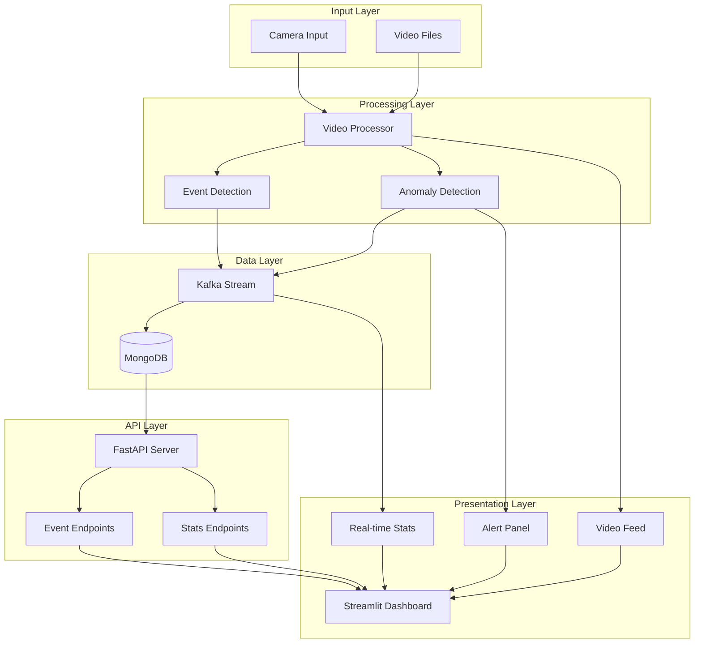

# Technical Architecture Specification
# Surveillance Video Event Detection System

## 1. System Architecture Diagram



## 2. Component Specifications

### 2.1 Video Processing Module

#### 2.1.1 Camera Integration
```python
class CameraStreamer:
    def __init__(self, camera_id=0, zone="entrance"):
        self.camera_id = camera_id
        self.zone = zone
        self.processor = VideoProcessor()
        self.frame_queue = queue.Queue()
        self.alert_threshold = 0.8
```

#### 2.1.2 Event Detection Pipeline
1. **Frame Capture**
   - Resolution: 1280x720
   - FPS: 30
   - Format: RGB

2. **Preprocessing**
   - Grayscale conversion
   - Gaussian blur
   - Frame differencing

3. **Detection Algorithms**
   - Face Detection: Haar Cascade Classifier
   - Body Detection: HOG + SVM
   - Motion Detection: Frame differencing + thresholding

### 2.2 Data Management

#### 2.2.1 Event Schema
```json
{
    "event_id": "string",
    "timestamp": "datetime",
    "event_type": "enum(face|body|motion)",
    "confidence": "float",
    "zone": "string",
    "location": {
        "x": "int",
        "y": "int",
        "width": "int",
        "height": "int"
    },
    "metadata": {
        "camera_id": "string",
        "frame_number": "int",
        "processing_time": "float"
    }
}
```

#### 2.2.2 Kafka Topics
- `surveillance-events`: Raw event data
- `high-confidence-events`: Events with confidence > 0.8
- `anomaly-events`: Detected anomalies

### 2.3 API Endpoints

#### 2.3.1 Event Endpoints
```python
@app.get("/api/events")
async def get_events(
    start_time: datetime,
    end_time: datetime,
    event_type: Optional[str] = None,
    zone: Optional[str] = None
)

@app.get("/api/events/recent")
async def get_recent_events(limit: int = 100)

@app.get("/api/events/stats")
async def get_event_stats(
    time_range: str = "24h",
    zone: Optional[str] = None
)
```

#### 2.3.2 Dashboard Endpoints
```python
@app.get("/api/dashboard-stats")
async def get_dashboard_stats()

@app.get("/api/access-logs")
async def get_access_logs()

@app.get("/api/intrusion-alerts")
async def get_intrusion_alerts()
```

### 2.4 Dashboard Components

#### 2.4.1 Real-time Display
- Video feed: 640x480
- Detection boxes: Blue for faces, Green for bodies
- Overlay text: Event type, confidence, timestamp

#### 2.4.2 Statistics Display
- Event timeline: Last 24 hours
- Heatmap: Events by zone and type
- Confidence distribution: Histogram
- Camera activity: Bar chart

## 3. Performance Specifications

### 3.1 Processing Pipeline
1. Frame capture: 33ms
2. Preprocessing: 10ms
3. Detection: 50ms
4. Event processing: 5ms
5. Total latency: < 100ms

### 3.2 Resource Requirements
- CPU: 4 cores minimum
- RAM: 8GB minimum
- Storage: 100GB minimum
- Network: 100Mbps minimum

### 3.3 Scalability
- Support for up to 4 cameras per instance
- Horizontal scaling for additional cameras
- Load balancing for API requests
- Database sharding for event storage

## 4. Security Implementation

### 4.1 Authentication
- JWT-based authentication
- Role-based access control
- Session management
- API key validation

### 4.2 Data Protection
- TLS encryption for all communications
- Video stream encryption
- Database encryption at rest
- Regular security audits

## 5. Monitoring and Logging

### 5.1 System Metrics
- CPU usage
- Memory consumption
- Network traffic
- Processing latency
- Detection accuracy

### 5.2 Application Logs
- Event processing logs
- API access logs
- Error logs
- Performance metrics

## 6. Deployment Configuration

### 6.1 Docker Services
```yaml
services:
  video-processor:
    image: surveillance-video-processor
    ports:
      - "8000:8000"
    environment:
      - KAFKA_BROKERS=kafka:9092
      - MONGODB_URI=mongodb://mongodb:27017
      - CAMERA_ID=0
      - ZONE=entrance

  api-server:
    image: surveillance-api
    ports:
      - "8001:8001"
    environment:
      - MONGODB_URI=mongodb://mongodb:27017
      - JWT_SECRET=your-secret-key

  dashboard:
    image: surveillance-dashboard
    ports:
      - "8501:8501"
    environment:
      - API_URL=http://api-server:8001
```

### 6.2 Environment Variables
```env
# Video Processing
CAMERA_ID=0
ZONE=entrance
PROCESSING_FPS=30
DETECTION_THRESHOLD=0.8

# Kafka
KAFKA_BROKERS=kafka:9092
KAFKA_TOPIC=surveillance-events

# MongoDB
MONGODB_URI=mongodb://localhost:27017
MONGODB_DB=surveillance

# API
API_HOST=0.0.0.0
API_PORT=8000
JWT_SECRET=your-secret-key

# Dashboard
REFRESH_INTERVAL=5
MAX_EVENTS=1000
```

## 7. Testing Strategy

### 7.1 Unit Tests
- Video processing functions
- Event detection algorithms
- API endpoints
- Data validation

### 7.2 Integration Tests
- End-to-end event flow
- Camera integration
- Dashboard updates
- Alert generation

### 7.3 Performance Tests
- Load testing
- Latency measurement
- Resource utilization
- Scalability testing 